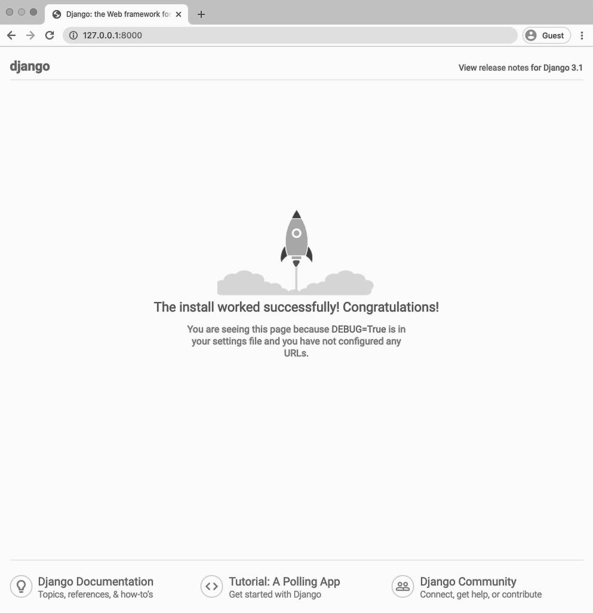
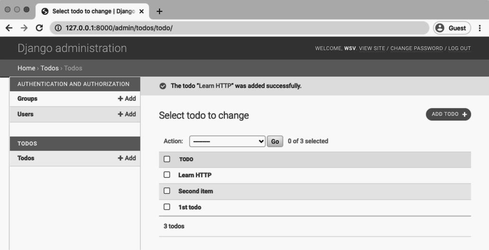
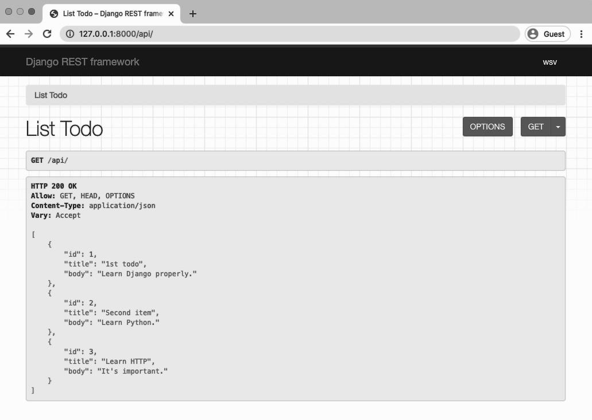
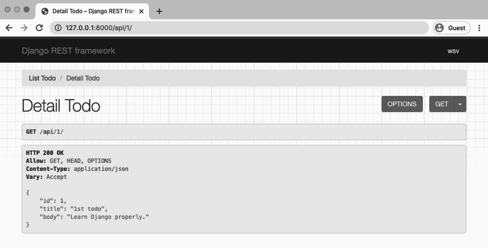

<div dir="rtl">

# Todo API

در طول دو فصل بعدی، یک Todo API back-end می سازیم و سپس آن را با یک React front-end متصل می کنیم. ما قبلاً اولین API خود را ساخته‌ایم و نحوه عملکرد HTTP و REST را به صورت انتزاعی بررسی کرده‌ایم، اما هنوز به احتمال زیاد شما هنوز «کاملاً» نمی‌بینید که چگونه همه با هم هماهنگ می‌شوند.

از آنجایی که ما در حال ساخت یک back-end و front-end اختصاصی هستیم، کد خود را به یک ساختار مشابه تقسیم می کنیم. در دایرکتوری کد موجود خود، یک دایرکتوری todo حاوی کد جنگو پایتون پشتیبان و کد React JavaScript جلویی ایجاد خواهیم کرد.
طرح نهایی به این صورت خواهد بود.


<div dir="ltr">

```
todo
|   ├──frontend
|       ├──React...
|   ├──backend
|       ├──Django...
```

</div>

این فصل بر روی back-end و فصل ۴ روی بخش front-end تمرکز دارد.


### تنظیمات اولیه

اولین قدم برای هر API جنگو این است که جنگو را نصب کنید و بعداً جنگو REST Framework را در بالای آن اضافه کنید. ابتدا یک دایرکتوری اختصاصی todo در دایرکتوری کد ما در دسکتاپ ایجاد کنید.


یک کنسول خط فرمان جدید باز کنید و دستورات زیر را در آن تایپ کنید:

<div dir="ltr">

```shell
$ cd ~/Desktop
$ cd code
$ mkdir todo && cd todo
```

</div>

توجه: مطمئن شوید که محیط مجازی را از فصل قبل غیرفعال کرده اید. می توانید این کار را با تایپ exit انجام دهید. آیا دیگر هیچ پرانتزی جلوی خط فرمان شما نیست؟ خوب سپس شما در یک محیط مجازی موجود نیستید.

در این پوشه todo، دایرکتوری های back-end و front-end ما قرار خواهند گرفت. بیایید پوشه Backend را ایجاد کنیم، جنگو را نصب کنیم و یک محیط مجازی جدید را فعال کنیم.

<div dir="ltr">

```shell
(backend) $ django-admin startproject config .
(backend) $ python manage.py startapp todos
(backend) $ python manage.py migrate
```

</div>

در جنگو ما همیشه نیاز داریم که برنامه‌های جدیدی را به تنظیمات INSTALLED_APPS خود اضافه کنیم، پس این کار را اکنون انجام دهید. config/settings.py را در ویرایشگر متن خود باز کنید. در انتهای فایل موارد زیر را اضافه کنید.

<div dir="ltr">

```python
# config/settings.py
INSTALLED_APPS = [
    'django.contrib.admin',
    'django.contrib.auth',
    'django.contrib.contenttypes',
    'django.contrib.sessions',
    'django.contrib.messages',
    'django.contrib.staticfiles',

    # Local
    'todos', # new
]
```

</div>

اگر اکنون سرور python manager.py را در خط فرمان اجرا کنید و در مرورگر وب خود به آدرس http://127.0.0.1:8000/ بروید، می توانید ببینید که پروژه ما با موفقیت نصب شده است.



برای رفتن به بخش بعد آماده ایم!

### مدلها

Next up is defining our Todo database model within the todos app. We will keep things basic and
have only two fields: title and body.
سپس باید مدل پایگاه داده ای Todo خود را در برنامه todo ایجاد کنیم. قرار است همه چیز را ساده نگه داریم و فقط دو فیلد داشته باشیم: موضوع و بدنه متن موضوع

<div dir="ltr">

```python
# todos/models.py
from django.db import models

class Todo(models.Model):
    title = models.CharField(max_length=200)
    body = models.TextField()
    
    def __str__(self):
        return self.title
```

</div>

ما مدل‌ها را در بالا وارد می‌کنیم و سپس آن‌ها را برای ایجاد مدل Todo خودمان طبقه‌بندی می‌کنیم. ما همچنین یک متد «__str__» اضافه می کنیم تا برای هر نمونه مدل آینده یک نام قابل خواندن توسط انسان ارائه کنیم.

از آنجایی که مدل خود را به‌روزرسانی کرده‌ایم، زمان رقص دو مرحله‌ای جنگو برای ساخت یک فایل مهاجرت جدید و سپس همگام‌سازی پایگاه داده با تغییرات هر بار فرا رسیده است. در خط فرمان Ctrl+c را تایپ کنید تا سرور محلی ما متوقف شود. سپس این دو دستور را اجرا کنید:

<div dir="ltr">

```shell
(backend) $ python manage.py makemigrations todos
Migrations for 'todos':
    todos/migrations/0001_initial.py
        - Create model Todo
(backend) $ python manage.py migrate
Operations to perform:
    Apply all migrations: admin, auth, contenttypes, sessions, todos
Running migrations:
    Applying todos.0001_initial... OK
```

</div>

اضافه کردن برنامه خاصی که می‌خواهیم برای آن یک فایل مهاجرت ایجاد کنیم اختیاری است – به جای آن می‌توانیم فقط python manager.py makemigrations را تایپ کنیم – با این حال بهترین روش برای اتخاذ آن است. فایل‌های مهاجرت راهی فوق‌العاده برای اشکال‌زدایی برنامه‌ها هستند و شما باید برای هر تغییر کوچک یک فایل مهاجرت ایجاد کنید. اگر مدل ها را در دو برنامه مختلف به روز کرده بودیم و سپس پایتون را اجرا می کردیم
manager.py makemigrations فایل مهاجرتی منفرد حاصل حاوی داده‌های مربوط به هر دو برنامه است. این فقط اشکال زدایی را سخت تر می کند. سعی کنید مهاجرت های خود را تا حد امکان کوچک نگه دارید.

اکنون می توانیم از برنامه داخلی Django admin برای تعامل با پایگاه داده خود استفاده کنیم. اگر بلافاصله وارد ادمین می‌شدیم، برنامه Todo ما ظاهر نمی‌شد. ما باید به صراحت آن را از طریق فایل todos/admin.py به صورت زیر اضافه کنیم.

<div dir="ltr">

```shell
# todos/admin.py
from django.contrib import admin
from .models import Todo

admin.site.register(Todo)
```

</div>

درست! اکنون می توانیم یک حساب کاربری فوق العاده برای ورود به ادمین ایجاد کنیم.

<div dir="ltr">

```shell
(backend) $ python manage.py createsuperuser
```

</div>

و سپس سرور محلی را دوباره راه اندازی کنید: 

<div dir="ltr">

```shell
(backend) $ python manage.py runserver
```

</div>

اگر به آدرس http://127.0.0.1:8000/admin/ بروید، اکنون می توانید وارد شوید. روی "Add +" در کنار Todos کلیک کنید و 3 مورد جدید برای انجام کار ایجاد کنید، مطمئن شوید که یک عنوان و متن برای هر دو اضافه کنید. مال من به این صورت است:



در واقع در این مرحله کار با بخش سنتی جنگو از Todo API ما تمام شده است. از آنجایی که ما زحمت ایجاد صفحات وب برای این پروژه را نداریم، نیازی به نشانی‌های وب، نماها، یا قالب‌ها نیست. تنها چیزی که ما نیاز داریم یک مدل است و Django REST Framework بقیه را بر عهده خواهد گرفت.

### Django REST Framework

با زدن Control+c سرور لوکال خود را قطع کنید و Django REST Framework را از طریق pipenv نصب کنید.

<div dir="ltr">

```shell
(backend) $ pipenv install djangorestframework~=3.11.0
```

</div>

سپس rest_framework را مانند هر برنامه شخص ثالث دیگری به تنظیمات INSTALLED_APPS خود اضافه کنید. ما همچنین می‌خواهیم تنظیمات خاص چارچوب REST جنگو را که همه در REST_FRAMEWORK وجود دارند، پیکربندی کنیم. برای شروع، اجازه دهید به صراحت مجوزها را روی 
[AllowAny](http://www.django-rest-framework.org/api-guide/permissions/#allowany) تنظیم کنیم. این خط در پایین فایل قرار می گیرد.

<div dir="ltr">

```python
INSTALLED_APPS = [
    'django.contrib.admin',
    'django.contrib.auth',
    'django.contrib.contenttypes',
    'django.contrib.sessions',
    'django.contrib.messages',
    'django.contrib.staticfiles',
    
    # 3rd party
    'rest_framework', # new
    
    # Local
    'todos',
]

# new
REST_FRAMEWORK = {
    'DEFAULT_PERMISSION_CLASSES': [
        'rest_framework.permissions.AllowAny',
    ]
}
```

</div>

جنگو رست فهرست طولانی‌ای از تنظیمات پیش‌فرض به طور ضمنی دارد. لیست کامل را می‌توانید در 
[اینجا](https://www.django-rest-framework.org/api-guide/settings/) ببینید. AllowAny یکی از آنهاست، به این معنی که وقتی ما آن را به صراحت تنظیم می‌کنیم، همانطور که در بالا انجام دادیم، اثر دقیقاً مشابه است که اگر هیچ مجموعه پیکربندی DEFAULT_PERMISSION_CLASSES نداشته باشیم.

یادگیری تنظیمات پیش فرض چیزی است که زمان می برد. در طول کتاب با تعدادی از آنها آشنا می شویم. نکته اصلی که باید به خاطر بسپارید این است که تنظیمات پیش‌فرض ضمنی به گونه‌ای طراحی شده‌اند که توسعه‌دهندگان بتوانند به سرعت در یک محیط توسعه محلی شروع به کار کنند. هر چند تنظیمات پیش فرض برای تولید مناسب نیست. بنابراین معمولاً ما در طول یک پروژه تغییراتی در آنها ایجاد می کنیم.

خوب، پس Django REST Framework نصب شده است. بعدش چی؟

بر خلاف پروژه کتابخانه در فصل قبل که هم یک صفحه وب و هم یک API ساختیم، در اینجا فقط یک API ایجاد می کنیم. بنابراین ما نیازی به ایجاد هیچ فایل قالب یا نمای سنتی جنگو نداریم.

در عوض، ما سه فایل را که برای تبدیل مدل پایگاه داده ما به یک وب API اختصاص دارند، به‌روزرسانی می‌کنیم: urls.py، views.py، و serializers.py.

### URLs

من دوست دارم ابتدا با URL ها شروع کنم زیرا آنها نقطه ورودی برای نقاط پایانی API ما هستند. درست مانند پروژه جنگو سنتی، فایل urls.py به ما امکان می دهد مسیریابی را پیکربندی کنیم.

از فایل سطح پروژه جنگو که config/urls.py است شروع کنید. ما شامل را در خط دوم وارد می کنیم و یک مسیر برای برنامه todos خود در api/ اضافه می کنیم.

<div dir="ltr">

```python
# config/urls.py
from django.contrib import admin
from django.urls import include, path # new

urlpatterns = [
    path('admin/', admin.site.urls),
    path('api/', include('todos.urls')), # new
]
```

</div>

سپس فایل todos/urls.py را در سطح برنامه ایجاد کنید.

<div dir="ltr">

```shell
(backend) $ touch todos/urls.py
```

</div>

و با کد زیر آن را آپدیت کنید.

<div dir="ltr">

```python
# todos/urls.py
from django.urls import path
from .views import ListTodo, DetailTodo

urlpatterns = [
    path('<int:pk>/', DetailTodo.as_view()),
    path('', ListTodo.as_view()),
]
```

</div>

توجه داشته باشید که ما به دو نما - ListTodo و DetailTodo - اشاره می کنیم که هنوز باید ایجاد کنیم. اما مسیریابی اکنون کامل شده است. لیستی از همه کارها در رشته خالی ''، به عبارت دیگر در api/ وجود خواهد داشت. و هر کار جداگانه در کلید اصلی خود در دسترس خواهد بود، که مقداری است که جنگو به طور خودکار در هر جدول پایگاه داده تنظیم می کند. ورودی اول 1، دومی 2 و غیره است. بنابراین اولین کار ما در نهایت در نقطه پایانی API api/1/ قرار خواهد گرفت.

### سریال ساز ها

بیایید مرور کنیم که تا به حال کجا هستیم. ما با یک پروژه و برنامه سنتی جنگو شروع کردیم که در آن یک مدل پایگاه داده ساختیم و داده ها را اضافه کردیم. سپس Django REST Framework را نصب کردیم و URL های خود را پیکربندی کردیم. اکنون باید داده های خود را از مدل ها به JSON تبدیل کنیم که در URL ها خروجی می شود. بنابراین ما به یک سریال ساز نیاز داریم.

Django REST Framework با یک کلاس سریال ساز داخلی قدرتمند عرضه می شود که می توانیم به سرعت با مقدار کمی کد آن را گسترش دهیم. این کاری است که ما در اینجا انجام خواهیم داد.

ابتدا یک فایل serializers.py جدید در برنامه todos ایجاد کنید.

<div dir="ltr">

```shell
(backend) $ touch todos/serializers.py
```

</div>

سپس با کد زیر آن را آپدیت کنید.

<div dir="ltr">

```python
# todos/serializers.py
from rest_framework import serializers
from .models import Todo

class TodoSerializer(serializers.ModelSerializer):
    class Meta:
        model = Todo
        fields = ('id', 'title', 'body',)
```

</div>

در بالا، ما سریال‌سازها را از Django REST Framework و همچنین فایل models.py خود وارد کرده‌ایم. سپس یک کلاس TodoSerializer ایجاد می کنیم. قالب در اینجا بسیار شبیه به نحوه ایجاد ما است
کلاس ها یا فرم ها را در خود جنگو مدل کنید. ما مشخص می‌کنیم که از کدام مدل استفاده کنیم و فیلدهای خاص روی آن را که می‌خواهیم در معرض نمایش بگذاریم. به یاد داشته باشید که id به طور خودکار توسط جنگو ایجاد می شود بنابراین ما این کار را نکردیم
باید آن را در مدل Todo خود تعریف کنیم، اما ما از آن در نمای جزئیات خود استفاده خواهیم کرد.

و همین است. Django REST Framework اکنون داده‌های ما را به شکل جادویی به JSON تبدیل می‌کند و فیلدهای شناسه، عنوان و بدنه مدل Todo ما را نشان می‌دهد.

آخرین کاری که باید انجام دهیم این است که فایل views.py خود را پیکربندی کنیم

### Views

در جنگو سنتی از نماها برای سفارشی کردن داده هایی که به قالب ها ارسال شود استفاده می شود. در Django REST Framework view ها همین کار را انجام می دهند اما برای داده های سریالی ما.

سینتکس نماهای چارچوب جنگو REST عمداً کاملاً شبیه نماهای جنگو معمولی است و درست مانند جنگو معمولی، جنگو REST Framework با نماهای عمومی برای موارد استفاده رایج ارائه می شود. این چیزی است که ما در اینجا استفاده خواهیم کرد.

فایل todos/views.py را به‌صورت زیر به‌روزرسانی کنید:

<div dir="ltr">

```python
# todos/views.py
from rest_framework import generics
from .models import Todo
from .serializers import TodoSerializer

class ListTodo(generics.ListAPIView):
    queryset = Todo.objects.all()
    serializer_class = TodoSerializer

class DetailTodo(generics.RetrieveAPIView):
    queryset = Todo.objects.all()
    serializer_class = TodoSerializer
```

</div>

در بالا، نماهای ژنریک چارچوب Django REST و هر دو فایل models.py و serializers.py خود را وارد می کنیم.

از فایل todos/urls.py به یاد بیاورید که ما دو مسیر و در نتیجه دو نمای مجزا داریم. ما از 
[ListAPIView](http://www.django-rest-framework.org/api-guide/generic-views/#listapiview) برای نمایش همه کارها و از 
[RetrieveAPIView](https://www.django-rest-framework.org/api-guide/generic-views/#retrieveapiview) برای نمایش یک نمونه مدل استفاده خواهیم کرد.

خوانندگان زیرک متوجه خواهند شد که در اینجا مقداری افزونگی در کد وجود دارد. ما اساسا queryset و serializer_class را برای هر نما تکرار می کنیم، حتی اگر نمای عمومی توسعه یافته متفاوت باشد. بعداً در این کتاب با مجموعه‌های نمایش و روترهایی آشنا می‌شویم که به این مشکل رسیدگی می‌کنند و به ما امکان می‌دهند همان نماهای API و URL‌ها را با کد بسیار کمتر ایجاد کنیم.

اما در حال حاضر کار ما تمام شده است! API ما آماده مصرف است. همانطور که می بینید، تنها تفاوت واقعی Django REST Framework و Django این است که با Django REST Framework باید یک فایل serializers.py اضافه کنیم و نیازی به فایل قالب نداریم. در غیر این صورت فایل‌های urls.py و views.py به روشی مشابه عمل می‌کنند.

### مصرف API

مصرف سنتی API یک چالش بود. به سادگی تجسم خوبی برای تمام اطلاعات موجود در بدنه و هدر یک پاسخ یا درخواست HTTP مشخص وجود نداشت.

در عوض، بیشتر توسعه دهندگان از یک سرویس گیرنده HTTP خط فرمان مانند [cURL](https://en.wikipedia.org/wiki/CURL) استفاده کردند که در فصل قبل یا [HTTPie](https://httpie.org/) دیدیم.

در سال 2012، محصول نرم‌افزار شخص ثالث [Postman](https://www.getpostman.com/) راه‌اندازی شد و اکنون توسط میلیون‌ها توسعه‌دهنده در سراسر جهان که می‌خواهند روشی بصری و غنی برای تعامل با APIها داشته باشند، از آن استفاده می‌کنند.

اما یکی از شگفت انگیزترین چیزها در مورد Django REST Framework این است که با یک API قابل مرور قدرتمند عرضه می شود که می توانیم بلافاصله از آن استفاده کنیم. اگر متوجه شدید که در مورد مصرف API به شخصی سازی بیشتری نیاز دارید، ابزارهایی مانند Postman در دسترس هستند. اما اغلب API داخلی بیش از اندازه کافی است.

### API قابل مرور

بیایید اکنون از API قابل مرور برای تعامل با داده های خود استفاده کنیم. مطمئن شوید که سرور محلی در حال اجرا است.

<div dir="ltr">

```shell
(backend) $ python manage.py runserver
```

</div>

سپس به http://127.0.0.1:8000/api/ بروید تا نقطه پایانی بازدیدهای لیست API ما را ببینید.



این صفحه سه کاری را که قبلاً در مدل پایگاه داده ایجاد کردیم را نشان می دهد. نقطه پایانی API به عنوان یک مجموعه شناخته می شود زیرا چندین مورد را نشان می دهد.

کارهای زیادی می توانیم با API قابل مرور خود انجام دهیم. برای شروع، بیایید نمای خام JSON را ببینیم - آنچه در واقع از طریق اینترنت منتقل می شود. بر روی دکمه "GET" در گوشه سمت راست بالا کلیک کنید و JSON را انتخاب کنید.


اگر به صفحه نمایش لیست ما در http://127.0.0.1:8000/api/ برگردید، می بینیم که اطلاعات بیشتری وجود دارد. به یاد داشته باشید که فعل HTTP GET برای خواندن داده ها استفاده می شود در حالی که POST برای به روز رسانی یا ایجاد داده ها استفاده می شود.

در زیر "List Todo" می‌گوید GET /api/ که به ما می‌گوید که ما یک GET در این نقطه پایانی انجام داده‌ایم. زیر آن می گوید HTTP 200 OK که کد وضعیت ماست، همه چیز کار می کند. بسیار مهم در زیر آن نشان می دهد ALLOW: GET، HEAD، OPTIONS. توجه داشته باشید که شامل POST نمی شود زیرا این یک نقطه پایانی فقط خواندنی است، ما فقط می توانیم GET را انجام دهیم.

ما همچنین یک نمای DetailTodo برای هر مدل جداگانه ایجاد کردیم. این به عنوان یک نمونه شناخته می شود و در http://127.0.0.1:8000/api/1/ قابل مشاهده است.



همچنین می توانید به نقاط پایانی برای موارد زیر بروید:

- http://127.0.0.1:8000/api/2
- http://127.0.0.1:8000/api/3

### CORS

آخرین مرحله ای که باید انجام دهیم وجود دارد و آن به 
[اشتراک گذاری منابع متقاطع CORS](https://developer.mozilla.org/en-US/docs/Web/HTTP/CORS) است. هر زمان که یک کلاینت با یک API میزبانی شده در دامنه دیگری (mysite.com در مقابل yoursite.com) یا پورت (localhost:3000 در مقابل localhost:8000) تعامل داشته باشد، مشکلات امنیتی احتمالی وجود دارد.

به طور خاص، CORS از سرور می‌خواهد که سربرگ‌های HTTP خاصی را شامل شود که به مشتری اجازه می‌دهد تعیین کند که آیا درخواست‌های بین دامنه‌ای مجاز هستند یا نه.

Django API back-end ما با یک front-end اختصاصی ارتباط برقرار می کند که در پورت دیگری برای توسعه محلی و پس از استقرار در دامنه دیگری قرار دارد.

ساده‌ترین راه برای رسیدگی به این مورد - و آنچه توسط 
[Django REST Framework](https://www.django-rest-framework.org/topics/ajax-csrf-cors/) توصیه می‌شود - استفاده از میان‌افزار است که به طور خودکار هدرهای HTTP مناسب را بر اساس تنظیمات ما شامل می‌شود.

بسته ای که ما استفاده خواهیم کرد 
[django-cors-headers](https://github.com/adamchainz/django-cors-headers) است که می تواند به راحتی به پروژه موجود ما اضافه شود.

ابتدا با Control+c از سرور خود خارج شوید و سپس هدرهای django-cors را با Pipenv نصب کنید.

<div dir="ltr">

```shell
(backend) $ pipenv install django-cors-headers==3.4.0
```

</div>

بعدی فایل config/settings.py ما را در سه مکان به روز کنید:

- corsheader هارا به INSTALLED_APPS اضافه کنید
- CorsMiddleware را بالاتر از CommonMiddleWare در MIDDLEWARE اضافه کنید
- یک CORS_ORIGIN_WHITELIST ایجاد کنید

<div dir="ltr">

```python
# config/settings.py
INSTALLED_APPS = [
    'django.contrib.admin',
    'django.contrib.auth',
    'django.contrib.contenttypes',
    'django.contrib.sessions',
    'django.contrib.messages',
    'django.contrib.staticfiles',

    # 3rd party
    'rest_framework',
    'corsheaders', # new
    
    # Local
    'todos',
]

MIDDLEWARE = [
    'django.middleware.security.SecurityMiddleware',
    'django.contrib.sessions.middleware.SessionMiddleware',
    'corsheaders.middleware.CorsMiddleware', # new
    'django.middleware.common.CommonMiddleware',
    'django.middleware.csrf.CsrfViewMiddleware',
    'django.contrib.auth.middleware.AuthenticationMiddleware',
    'django.contrib.messages.middleware.MessageMiddleware',
    'django.middleware.clickjacking.XFrameOptionsMiddleware',
]

# new
CORS_ORIGIN_WHITELIST = (
    'http://localhost:3000',
    'http://localhost:8000',
)
```

</div>

بسیار مهم است که corsheaders.middleware.CorsMiddleware در مکان مناسب ظاهر شود. این بالاتر از django.middleware.common.CommonMiddleware در تنظیمات MIDDLEWARE است زیرا میان افزارها از بالا به پایین بارگذاری می شوند. همچنین توجه داشته باشید که ما دو دامنه را در لیست سفید قرار داده ایم: localhost:3000 و localhost:8000. اولی پورت پیش‌فرض React است که در فصل بعدی از آن برای front-end خود استفاده خواهیم کرد. دومی پورت پیش فرض جنگو است.

### تست ها

شما همیشه باید برای پروژه های جنگو خود تست بنویسید. مقدار کمی از زمان صرف شده از قبل باعث صرفه جویی در زمان و تلاش زیادی برای خطاهای اشکال زدایی می شود. بیایید دو تست اساسی اضافه کنیم تا تأیید کنیم که عنوان و محتوای متن همانطور که انتظار می رود رفتار می کنند. فایل todos/tests.py را باز کنید و آن را با موارد زیر پر کنید:

<div dir="ltr">

```python
# todos/tests.py
from django.test import TestCase
from .models import Todo

class TodoModelTest(TestCase):
    @classmethod
    def setUpTestData(cls):
        Todo.objects.create(title='first todo', body='a body here')
    
    def test_title_content(self):
        todo = Todo.objects.get(id=1)
        expected_object_name = f'{todo.title}'
        self.assertEqual(expected_object_name, 'first todo')

    def test_body_content(self):
        todo = Todo.objects.get(id=1)
        expected_object_name = f'{todo.body}'
        self.assertEqual(expected_object_name, 'a body here')
```

</div>

این از کلاس [TestCase](https://docs.djangoproject.com/en/3.1/topics/testing/tools/#testcase) داخلی جنگو استفاده می کند. ابتدا داده های خود را در setUpTestData تنظیم می کنیم و سپس دو تست جدید می نویسیم. سپس با دستور python manager.py تست ها را اجرا کنید.

<div dir="ltr">

```shell
(backend) $ python manage.py test
Creating test database for alias 'default'...
System check identified no issues (0 silenced).
..
----------------------------------------------------------------------
Ran 2 tests in 0.002s
OK
Destroying test database for alias 'default'...
```

</div>

و تمام! بک‌اند ما اکنون کامل شده است. مطمئن شوید که سرور در حال اجرا است زیرا در فصل بعدی از آن استفاده خواهیم کرد.

<div dir="ltr">

```shell
(backend) $ python manage.py runserver
```

</div>

### نتیجه گیری

با حداقل مقدار کد Django REST Framework به ما این امکان را می دهد که یک API جنگو را از ابتدا ایجاد کنیم. تنها قطعاتی که از جنگو سنتی نیاز داشتیم یک فایل models.py و مسیرهای urls.py ما بود. فایل‌های views.py و serializers.py کاملاً مختص چارچوب REST جنگو بودند.

برخلاف مثال ما در فصل قبل، ما هیچ صفحه وب برای این پروژه ایجاد نکردیم زیرا هدف ما فقط ایجاد یک API بود. با این حال در هر نقطه ای در آینده، ما به راحتی می توانیم! این فقط نیاز به افزودن یک نمای جدید، URL و یک الگو دارد تا مدل پایگاه داده موجود ما را نشان دهد.

یک نکته مهم در این مثال این است که ما هدرهای CORS را اضافه کردیم و به صراحت فقط دامنه های localhost:3000 و localhost:8000 را برای دسترسی به API خود تنظیم کردیم. تنظیم صحیح هدرهای CORS موضوعی آسان است که هنگام شروع ساختن APIها در مورد آن سردرگم می شود.
پیکربندی‌های بسیار بیشتری وجود دارد که می‌توانیم انجام دهیم و بعداً انجام خواهیم داد، اما در پایان روز ایجاد API های جنگو در مورد ساخت یک مدل، نوشتن برخی از مسیرهای URL، و سپس افزودن کمی جادوی ارائه شده توسط سریال‌سازها و نماهای جنگو REST Framework است. فصل بعدی یک React front-end می‌سازیم و آن را به باطن Todo API خود متصل می‌کنیم.

</div>