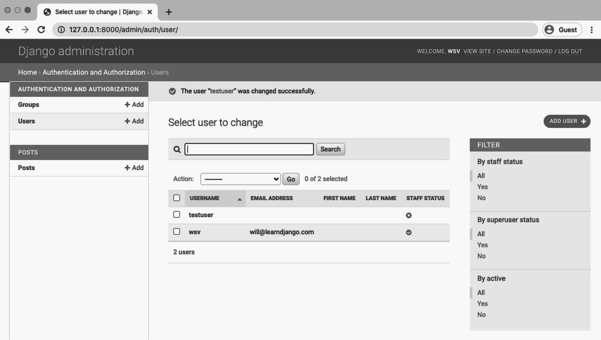

  
# مجوزها    
  
امنیت بخش مهمی از هر وب‌سایت است اما با API ها دو چندان می‌شود.در حال حاضر API ما اجازه دسترسی کامل به هر شخصی را می‌دهد. هیچ محدودیتی وجود ندارد و هر کاربری هر کاری می‌تواند انجام دهد که بسیار خطرناک است.به عنوان مثال، یک کاربر ناشناس می‌تواند پستی را ایجاد کند، بخواند، تغییر دهد یا حذف کند. حتی آن پستی که خودش ایجاد نکرده‌است.مشخصاً ما چنین چیزی را نمی‌خواهیم.

البته `Django REST Framework` با تنظیمات ساده‌ي مجوزها همراه می‌باشد که ما می‌توانیم از آنها برای ایمن کردن API استفاده کنیم.
این تنظیمات را می‌توان در سطح پروژه، در سطح نما یا در سطح هر مدل اعمال کرد.
  
در این فصل ابتدا یک کاربر جدید اضافه می‌کنیم و تنظیمات چندین مجوز را آزمایش می‌کنیم. سپس مجوز شخصی‌سازی شده‌ی خودمان را طوری ایجاد می‌کنیم که تنها نویسنده آن پست بتواند آن‌را بروزرسانی یا حذف کند.
  
 ### ایجاد کاربر جدید
 بیایید با ایجاد کاربر دوم شروع کنیم. با این کار می‌توانیم بین اکانت‌های این دو کاربر جابجا شویم تا تنظیمات مجوزها را آزمایش کنیم.
 
به پنل ادمین در `/http://127.0.0.1:8000/admin` بروید.سپس روی “+ Add” کنار Users کلیک کنید. نام‌کاربری و پسورد را برای کاربر جدید وارد کنید و سپس بر روی دکمه‌ی 'Save' کلیک کنید. من در اینجا نام‌کاربری را testuser انتخاب کرده‌ام.
  

تصویر بعدی صفحه‌ی ادمین برای تغییر کاربرها می‌باشد. من کاربر خود را testuser  انتخاب کرده‌ام و در اینجا می‌توانم اطلاعات بیشتری را نظیر نام، نام‌خانوادگی، آدرس ایمیل، آدرس و ...به مدل کاربر اضافه کنم. اما هیچکدام از آنها برای مقصود ما مهم نیستند: ما فقط به نام‌کاربری و پسورد برای آزمایش نیاز داریم. 
  

به پایین این صفحه رفته و روی دکمه‌ی 'Save' کلیک کنید. که به صفحه اصلی کاربران در .
/http://127.0.0.1:8000/admin/auth/user
هدایت می‌کند.
  
 
  
 همانطور که می‌بینید دو کاربر ما حضور دارند.
  
 ### اضافه کردن قابلیت ورود به API قابل مرور
 
 هر بار که بخواهیم بین دو کاربر جابجا شویم باید به پنل ادمین جنگو رفته و از آن حساب خارج شده و به دیگری لاگین کنیم. سپس به API موردنظر برویم.
 
این اتفاق معمولی هست که`Django REST Framework`  تنظیمی یک خطی برای اضافه  کردن قابلیت وارد و خارج شدن کاربر به صورت مستقیم به API قابل جستجو دارد. که ما آن‌را الان پیاده‌سازی می‌کنیم.
 
  

 
