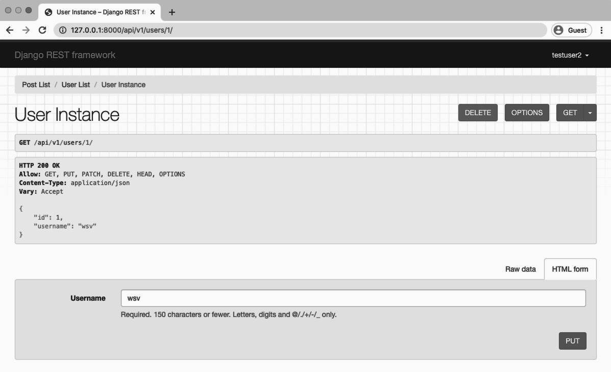
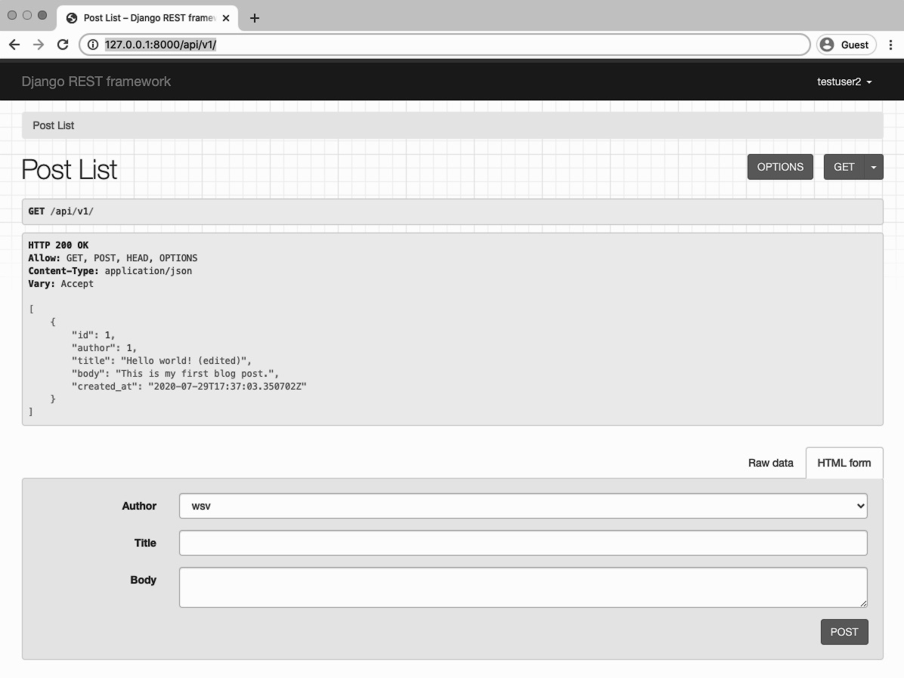

<div dir="ltr">


# Viewsets and Routers

Viewsets89 and routers90 are tools within Django REST Framework that can speed-up API
development. They are an additional layer of abstraction on top of views and URLs. The primary
benefit is that a single viewset can replace multiple related views. And a router can automatically
generate URLs for the developer. In larger projects with many endpoints this means a developer
has to write less code. It is also, arguably, easier for an experienced developer to understand and
reason about a small number of viewset and router combinations than a long list of individual
views and URLs.

In this chapter we will add two new API endpoints to our existing project and see how switching
from views and URLs to viewsets and routers can achieve the same functionality with far less
code.


### User endpoints
Currently we have the following API endpoints in our project. They are all prefixed with api/v1/
which is not shown for brevity:

Diagram
```code
|Endpoint                              |HTTP Verb|
|--------------------------------------|---------|
|/                                     |GET      |
|/:pk/                                 |GET      |
|/rest-auth/registration               |POST     |
|/rest-auth/login                      |POST     |
|/rest-auth/logout                     |GET      |
|/rest-auth/password/reset             |POST     |
|/rest-auth/password/reset/confirm     |POST     |

```


The first two endpoints were created by us while dj-rest-auth provided the five others. Let’s
now add two additional endpoints to list all users and individual users. This is a common feature
in many APIs and it will make it clearer why refactoring our views and URLs to viewsets and
routers can make sense.

Traditional Django has a built-in User model class that we have already used in the previous
chapter for authentication. So we do not need to create a new database model. Instead we just
need to wire up new endpoints. This process always involves the following three steps:

- new serializer class for the model
- new views for each endpoint
- new URL routes for each endpoint

Start with our serializer. We need to import the User model and then create a UserSerializer
class that uses it. Then add it to our existing posts/serializers.py file.

code
```python
# posts/serializers.py
from django.contrib.auth import get_user_model # new
from rest_framework import serializers
from .models import Post


class PostSerializer(serializers.ModelSerializer):
    class Meta:
        model = Post
        fields = ('id', 'author', 'title', 'body', 'created_at',)


class UserSerializer(serializers.ModelSerializer): # new
    class Meta:
      model = get_user_model()
      fields = ('id', 'username',)
```


It’s worth noting that while we have used get_user_model to reference the User model here,
there are actually three different ways to reference91 the User model in Django.

By using get_user_model we ensure that we are referring to the correct user model, whether it
is the default User or a custom user model92 as is often defined in new Django projects.

Moving on we need to define views for each endpoint. First add UserSerializer to the list
of imports. Then create both a UserList class that lists out all users and a UserDetail class
that provides a detail view of an individual user. Just as with our post views we can use
ListCreateAPIView and RetrieveUpdateDestroyAPIView here. We also need to reference the
users model via get_user_model so it is imported on the top line.

code
```python
# posts/views.py
from django.contrib.auth import get_user_model # new
from rest_framework import generics
from .models import Post
from .permissions import IsAuthorOrReadOnly
from .serializers import PostSerializer, UserSerializer # new


class PostList(generics.ListCreateAPIView):
    queryset = Post.objects.all()
    serializer_class = PostSerializer


class PostDetail(generics.RetrieveUpdateDestroyAPIView):
    permission_classes = (IsAuthorOrReadOnly,)
    queryset = Post.objects.all()
    serializer_class = PostSerializer


class UserList(generics.ListCreateAPIView): # new
    queryset = get_user_model().objects.all()
    serializer_class = UserSerializer


class UserDetail(generics.RetrieveUpdateDestroyAPIView): # new
    queryset = get_user_model().objects.all()
    serializer_class = UserSerializer

```


If you notice, there is quite a bit of repetition here. Both Post views and User views have the
exact same queryset and serializer_class. Maybe those could be combined in some way to
save code?

Finally we have our URL routes. Make sure to import our new UserList, and UserDetail views.
Then we can use the prefix users/ for each.


code
```python
# posts/urls.py
from django.urls import path
from .views import UserList, UserDetail, PostList, PostDetail # new


urlpatterns = [
    path('users/', UserList.as_view()), # new
    path('users/<int:pk>/', UserDetail.as_view()), # new
    path('', PostList.as_view()),
    path('<int:pk>/', PostDetail.as_view()),
]

```

And we’re done. Make sure the local server is still running and jump over to the browsable API
to confirm everything works as expected.

Our user list endpoint is located at http://127.0.0.1:8000/api/v1/users/


The status code is 200 OK which means everything is working. We can see our three existing
users.

A user detail endpoint is available at the primary key for each user. So our superuser account is
located at: http://127.0.0.1:8000/api/v1/users/1/.  


### Viewsets

A viewset is a way to combine the logic for multiple related views into a single class. In other
words, one viewset can replace multiple views. Currently we have four views: two for blog posts
and two for users. We can instead mimic the same functionality with two viewsets: one for blog
posts and one for users.

The tradeoff is that there is a loss in readability for fellow developers who are not intimately
familiar with viewsets. So it’s a trade-off.

Here is what the code looks like in our updated posts/views.py file when we swap in viewsets.


code
```python
# posts/views.py
from django.contrib.auth import get_user_model
from rest_framework import viewsets # new
from .models import Post
from .permissions import IsAuthorOrReadOnly
from .serializers import PostSerializer, UserSerializer


class PostViewSet(viewsets.ModelViewSet): # new
    permission_classes = (IsAuthorOrReadOnly,)
    queryset = Post.objects.all()
    serializer_class = PostSerializer


class UserViewSet(viewsets.ModelViewSet): # new
    queryset = get_user_model().objects.all()
    serializer_class = UserSerializer
```

At the top instead of importing generics from rest_framework we are now importing viewsets
on the second line. Then we are using ModelViewSet93 which provides both a list view and a
detail view for us. And we no longer have to repeat the same queryset and serializer_class
for each view as we did previously!

At this point, the local web server will stop as Django complains about the lack of corresponding
URL paths. Let’s set those next.


### Routers
Routers94 work directly with viewsets to automatically generate URL patterns for us. Our current
posts/urls.py file has four URL patterns: two for blog posts and two for users. We can instead
adopt a single route for each viewset. So two routes instead of four URL patterns. That sounds
better, right?

Django REST Framework has two default routers: SimpleRouter95 and DefaultRouter96. We will
use SimpleRouter but it’s also possible to create custom routers for more advanced functionality.
Here is what the updated code looks like:


```python
# posts/urls.py
from django.urls import path
from rest_framework.routers import SimpleRouter
from .views import UserViewSet, PostViewSet

router = SimpleRouter()
router.register('users', UserViewSet, basename='users')
router.register('', PostViewSet, basename='posts')

urlpatterns = router.urls
```


On the top line SimpleRouter is imported, along with our views. The router is set to SimpleRouter
and we “register” each viewset for Users and Posts. Finally, we set our URLs to use the new
router. Go ahead and check out our four endpoints now by starting the local server with `python
manage.py runserver`.


Note that the User List is the same, however the detail view is a little different. It is now called
“User Instance” instead of “User Detail” and there is an additional “delete” option which is built-in
to ModelViewSet97



It is possible to customize viewsets but an important tradeoff in exchange for writing a bit less
code with viewsets is the default settings may require some additional configuration to match
exactly what you want.

Moving along to the Post List at http://127.0.0.1:8000/api/v1/ we can see it is the same:  



And, importantly, our permissions still work. When logged-in with our testuser2 account, the
Post Instance at http://127.0.0.1:8000/api/v1/1/ is read-only.


However, if we log in with our superuser account, which is the author of the solitary blog post,
then we have full read-write-edit-delete privileges.


### Conclusion
Viewsets and routers are a powerful abstraction that reduce the amount of code we as developers
must write. However this conciseness comes at the cost of an initial learning curve. It will feel
strange the first few times you use viewsets and routers instead of views and URL patterns.

Ultimately the decision of when to add viewsets and routers to your project is quite subjective.
A good rule of thumb is to start with views and URLs. As your API grows in complexity if you find
yourself repeating the same endpoint patterns over and over again, then look to viewsets and
routers. Until then, keep things simple.
